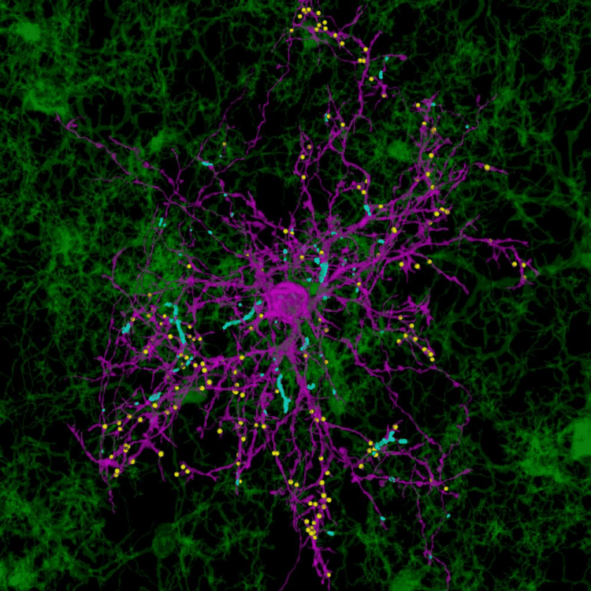

# Austin Ferro, PhD

**Postdoctoral Fellow · Cheadle Lab · Cold Spring Harbor Laboratory & HHMI**

*Neuroscientist | Glial Biology | Circuit Development | Multimodal Imaging*

---

## About Me

I am a senior postdoctoral fellow in [Dr. Lucas Cheadle's lab]([https://www.cshl.edu/research/faculty-staff/lucas-cheadle/](https://www.cheadlelab.com/)) with joint appointments at Cold Spring Harbor Laboratory (CSHL) and HHMI. My research focuses on how glia — astrocytes, microglia, and oligodendrocyte precursor cells (OPCs) — interact with neurons and with each other to aid in the formation and function neural circuits.

I am particularly interested in how glia engage, both directly and indirectly, at the synapse to shape brain development and contribute to neurodevelopmental and neurodegenerative diseases. To answer these questions, I employ a range of cutting-edge imaging modalities including **single-photon** and **multiphoton microscopy**, **electron microscopy**, and custom image analysis pipelines.

---

## Featured Imaging

> *OPC–microglia contacts at synapses in the developing mouse visual cortex.*

---

## Selected Publications
**A. Ferro***, Y. S. S. Auguste*, J. A. Kahng, A. M. Xavier, J. R. Dixon, U. Vrudhula, A. S. Nichitiu, D. Rosado, T. L. Wee, U. V. Pedmale, L. Cheadle, Oligodendrocyte precursor cells engulf synapses during circuit remodeling in mice. Nature Neuroscience 25 (2022). https://doi.org/10.1038/s41593-022-01170-x   *Equal contributions

**Ferro A**, Vita DJ, Fallon T, Arshad A, Boyd L, Stanley T, Lin Q, Berisha A, Vrudhula U, Gomez AM, Sanchez-Martin I, Borniger JC, Cheadle L. Fn14 is an activity-dependent, Bmal1-regulated cytokine receptor that induces rod-like microglia and restricts neuronal activity in vivo. Cell Reports, 45(2):116926. (2026) https://doi.org/10.1016/j.celrep.2026.116926

J. A. Kahng, A. M. Xavier, **A. Ferro**, S. X. Tang, Y. S. S. Auguste, L. Cheadle, High-confidence and high-throughput quantification of synapse engulfment by oligodendrocyte precursor cells. Nature Protocols, 1–33 (2024). https://doi.org/10.1038/s41596-024-01048-1

📚 [Full publication list on Google Scholar](https://scholar.google.com/citations?user=997G3cYAAAAJ&hl=en)

---

## Research Areas

| Domain | Techniques |
|---|---|
| Glial–synapse interactions | Multiphoton live imaging |
| OPC phagocytosis | Super resolution microscopy |
| Glial modulation of neural activity | Electron microscopy |
| Neuro-immune signaling | scRNA-seq & transcriptomics |
| Neurodevelopment & neurodegeneration | Custom image analysis pipelines |

---

## CV

📄 [Download CV (2026)](AUSTIN%20FERRO_CV2026.docx)

---

*Cold Spring Harbor, NY · [ferro@cshl.edu](mailto:ferro@cshl.edu)*

